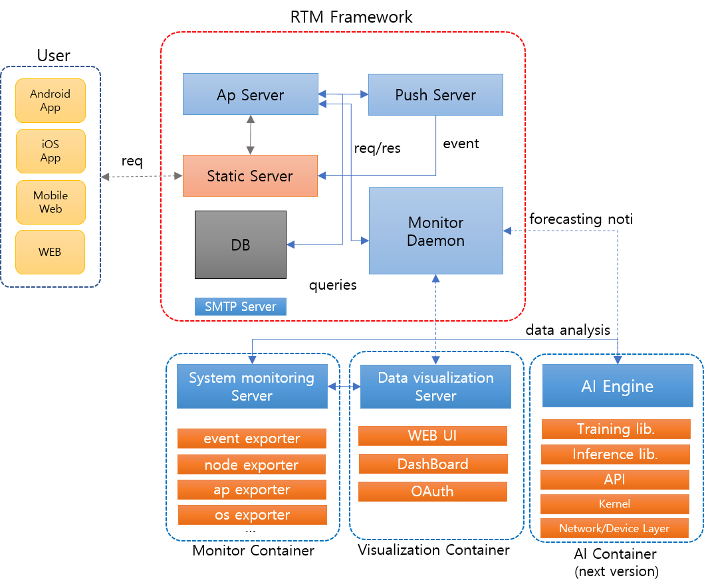
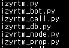
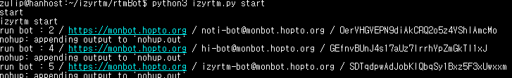
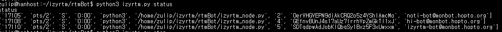
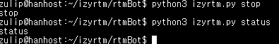

# izyrtm-server

izyrtm은 RTM 자동화를 위한 봇을 손쉽게 생성/운영 할 수 있도록 도와주는 솔루션입니다. 

## What's Better
- 기존 : 관제, 상황창 분리 운영 및 상황 발생시 현황 파악이 어려워 대응 늦음
- izyrtm : 
   1) 관제/상황창이 한 화면으로 구성
   2) rtm 봇에 의해 관제가 자동 운영
   3) 이상징후 발생시 자동 상황창 구성
   4) 실시간 관제 차트 제공
   5) 자동 관련인 초대가 가능
   6) 서비스 재기동 등 자동으로 조치 가능
   7) 상황 종료 후 상황창 이력 근거 데이터로 활용

## Architecture

- 구성 : zulip + prometheus + grafana + rtm daemon

## How To Use
### Install & Build

1) zulip 설치

https://zulip.readthedocs.io/en/stable/production/install.html

2) prometheus + grafana + smtp 설치
- 파일 다운 : [docker-compose.yml](./docker-compose.yml), [prometheus.yml](./prometheus.yml)
- 빌드/설치/실행 : docker-compose up -d
- 삭제시 : docker-compose rm -s

3) rtm daemon 설치
- 파일 다운 : [rtmBot 폴더](./rtmBot) 다운

### Run

- start izyrtmDaemon -> python3 izyrtm.py start  
- stop izyrtmDaemon -> python3 izyrtm.py stop
- status izyrtmDaemon ->python3 izyrtm.py status

- rtm daemon 구성

- izyrtm 실행

- izyrtm 노드 start

- izyrtm 노드 status

- izyrtm 노드 stop

## Reference
- Zulip : [https://zulipchat.com/](https://zulipchat.com/)
- Prometheus : [https://prometheus.io/](https://prometheus.io/)
- Grafana : [https://grafana.com/](https://grafana.com/)

## License
- Zulip : Apache License 2.0, [https://github.com/zulip/zulip/blob/master/LICENSE](https://github.com/zulip/zulip/blob/master/LICENSE)
- Prometheus : Apache License 2.0, [https://github.com/prometheus/docs/blob/master/LICENSE](https://github.com/prometheus/docs/blob/master/LICENSE)
- Grafana : Apache License 2.0, [https://github.com/grafana/grafana/blob/master/LICENSE](https://github.com/grafana/grafana/blob/master/LICENSE)
- izyrtm : Apache License 2.0, [https://github.com/izyrtm/izyrtm-server/blob/master/LICENSE](https://github.com/izyrtm/izyrtm-server/blob/master/LICENSE)
